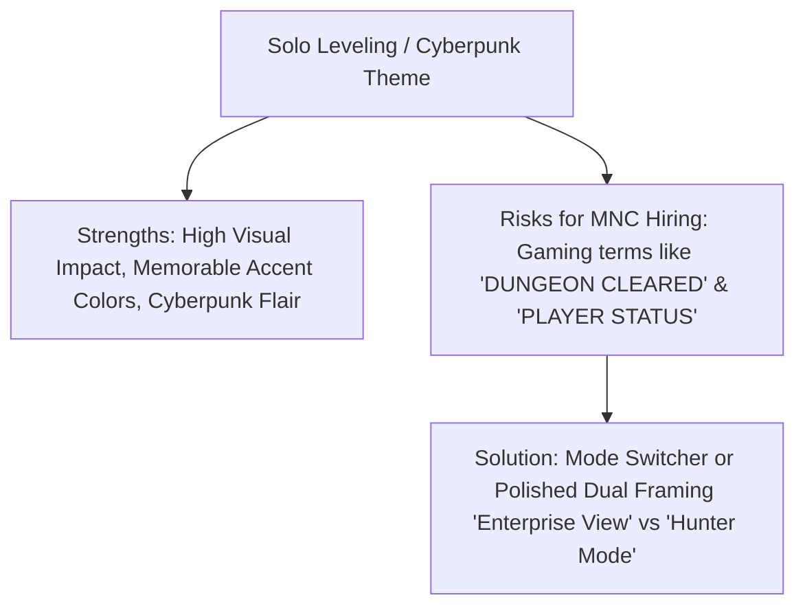
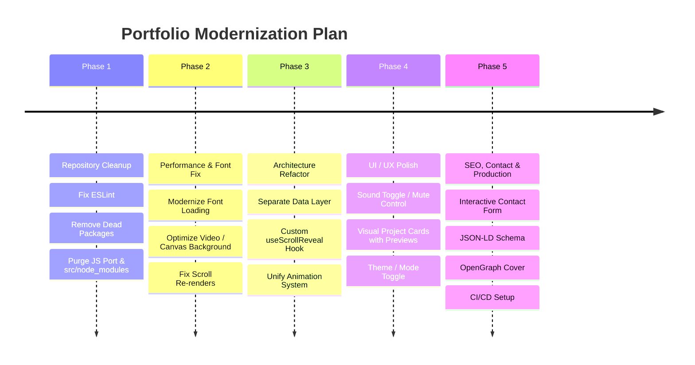

# 🚀 Rajithran Portfolio — Comprehensive Technical Audit & Upgrade Blueprint

**Audit Date:** August 2026  
**Audited Repository:** `rajithran-portfolio`  
**Current Tech Stack:** React 19, Vite 7, Framer Motion 12, Vanilla CSS  
**Target Goal:** MNC-Grade Professional Portfolio, Scalable Architecture, Ultra-High Performance & Future-Proof Readiness

---

## 📊 Executive Scorecard & Health Overview

| Dimension | Score | Rating | Primary Finding |
| :--- | :---: | :---: | :--- |
| **1. Repository & Project Hygiene** | `52 / 100` | ⚠️ Needs Work | `src/node_modules` stray directory, 65MB legacy `JS Port/` folder, unused assets. |
| **2. Tech Stack & Dependencies** | `68 / 100` | 🟡 Moderate | Dead packages (`typewriter-effect`), unused `react-icons`, ESLint configuration error. |
| **3. Performance & Core Web Vitals** | `61 / 100` | 🟡 Moderate | 7.7MB uncompressed hero video, `@import` font waterfall, un-throttled scroll re-renders. |
| **4. UI / UX & Design System** | `78 / 100` | 🟢 Good | Distinct Solo Leveling aesthetic, but lacks audio mute control & project visuals. |
| **5. Code Quality & Architecture** | `64 / 100` | 🟡 Moderate | Copy-pasted `IntersectionObserver` in 5 files, hardcoded inline data, missing TypeScript. |
| **6. Accessibility (a11y) & Standards**| `58 / 100` | ⚠️ Needs Work | Non-semantic toggle button, missing ARIA tags, no `prefers-reduced-motion` support. |
| **7. SEO, Social & Meta Tags** | `72 / 100` | 🟢 Good | Strong base meta tags, but missing JSON-LD schema, missing `cover.jpg`, `robots.txt`, and `sitemap.xml`. |
| **8. Security & Privacy** | `70 / 100` | 🟢 Good | Plaintext phone number scrapable by bots, hardcoded external links. |

---

## 🔍 Section-by-Section Deep Audit

### 1. Repository Hygiene & Project Structure

```
rajithran-portfolio/
├── JS Port/              ⚠️ 65+ MB of legacy files (37MB 4K MP4, 20.5MB PNG, old scripts)
├── src/
│   ├── node_modules/     ❌ Redundant nested node_modules inside src/ (contains framer-motion)
│   ├── assets/images/    ⚠️ 6 WebP images (~2.7MB) exist but are NOT imported or displayed
│   ├── components/       📁 Navbar, Footer
│   ├── sections/         📁 Hero, About, Skills, Experience, Projects, Contact
├── public/
│   ├── videos/hero-bg.webm ⚠️ 7.77 MB video loaded unconditionally on page load
│   ├── P_Rajithran_Resume_2025.pdf
│   └── sound.mp3
```

#### Key Findings:
1. **Accidental Nested `src/node_modules/`:** An extra `node_modules` folder exists at `src/node_modules` containing duplicate files for `framer-motion`. This bloats the source tree and can confuse tooling/IDEs.
2. **Legacy Directory Bloat (`JS Port/`):** Contains `3129595-uhd_3840_2160_30fps.mp4` (37.1 MB), `goku.png` (20.5 MB), and `solo.mp4` (7.3 MB). These large untracked legacy files slow down git operations and clutter the workspace.
3. **Ghost Assets in `src/assets/images/`:** High-quality mockups (`vetro.webp`, `vetro1.webp`, `solo.webp`, etc.) exist in `src/assets/images/`, but neither `Projects.jsx` nor any other component imports or displays them.
4. **Duplicate Resume Files:** `P_RAjithran_Resume_2025.pdf` exists in the root directory, inside `public/`, and inside `JS Port/`.

---

### 2. Tech Stack, Dependencies & Build System

#### Current `package.json` Review:
```json
{
  "dependencies": {
    "framer-motion": "^12.36.0",
    "react": "^19.1.0",
    "react-dom": "^19.1.0",
    "react-icons": "^5.5.0",
    "typewriter-effect": "^2.22.0"
  },
  "devDependencies": {
    "@eslint/js": "^9.29.0",
    "rollup-plugin-visualizer": "^6.0.3",
    "vite": "^7.0.0"
  }
}
```

#### Issues & Inconsistencies:
1. **Phantom Dependency (`typewriter-effect`):** Installed in `package.json`, but `0` imports exist in the entire codebase.
2. **Underutilized Dependency (`react-icons`):** Installed, yet components use text acronyms (`GM`, `LN`, `GH` in `Contact.jsx`) and plain emojis (`⚡`, `⚙️`, `🗄️` in `Skills.jsx`).
3. **Animation Library Mismatch:** `framer-motion` (adds ~100 kB+ to the JS bundle) is imported **only** in `Hero.jsx`. Meanwhile, all other sections (`About.jsx`, `Skills.jsx`, `Experience.jsx`, `Projects.jsx`, `Contact.jsx`) use raw `IntersectionObserver` with CSS transitions.
4. **ESLint Rule Failure:** Running `npm run lint` fails with:
   ```
   E:\rajithran-portfolio\src\sections\Hero.jsx
     2:10  error  'motion' is defined but never used (varsIgnorePattern: /^[A-Z_]/)
   ```
   The regex in `eslint.config.js` expects uppercase variable names, flagging `<motion.div>` as unused.
5. **Unused Dev Plugins:** `rollup-plugin-visualizer` is installed in `devDependencies` but never imported or configured inside `vite.config.js`.

---

### 3. Performance & Core Web Vitals (CWV)

#### Critical Bottlenecks:

1. **Font Loading Waterfall & Dead Preloads:**
   - In `index.html` (Lines 28–33): Preloads and loads `Poppins` and `Playfair Display`, which are **never used** anywhere in `index.css` or component styles.
   - In `index.css` (Line 1): Loads `Orbitron`, `Rajdhani`, and `Space Mono` via `@import url(...)`.
   > [!WARNING]
   > `@import` in CSS blocks rendering until the external font stylesheet is downloaded and parsed. Preloading dead fonts wastes critical network bandwidth.

2. **Heavy Hero Background Video (`7.77 MB WebM`):**
   - `public/videos/hero-bg.webm` is downloaded on initial page load regardless of connection speed or mobile device mode.
   - Causes high LCP (Largest Contentful Paint) penalty, battery drain, and bandwidth exhaustion for mobile visitors.
   - No `poster` fallback image is configured for when video fails or delays loading.

3. **React Re-render Storm on Scroll in `App.jsx`:**
   ```jsx
   // App.jsx: Line 19
   const handleScroll = () => {
     const total = document.documentElement.scrollHeight - window.innerHeight
     setScroll((window.scrollY / total) * 100)
   }
   window.addEventListener('scroll', handleScroll)
   ```
   Updating `scroll` state on raw scroll events without `requestAnimationFrame` or debouncing triggers a top-level React render of `App` (and all children) on every single scrolled pixel.
   *(Modern standard: CSS Scroll-Driven Animations via `animation-timeline: scroll()` or a dedicated non-rendering CSS custom property).*

4. **Endless Animation Loop & Event Listener Leaks:**
   - In `App.jsx`, `animateRing` calls `requestAnimationFrame(animateRing)` recursively without cancellation on component unmount.
   - Listeners for `mousemove`, `mousedown`, `mouseup`, `click`, and `mouseenter`/`mouseleave` are never removed in the `useEffect` cleanup.

---

### 4. UI / UX, Theme & Career Positioning



#### UX & Visual Feedback:
1. **Intrusive Audio Without Mute Toggle:**
   - Clicking any `<a>` or `<button>` triggers `sound.mp3` automatically (volume 0.3).
   - Visitors in professional/office environments or users with sensory sensitivity have no UI control to toggle sound on/off.
2. **Missing Project Thumbnails / Interactive Showcase:**
   - `Projects.jsx` currently displays plain text cards with tech tags and links.
   - Portfolio recruiters evaluate UI/UX in seconds; showcasing high-res product mockups (like `vetro.webp`) with hover-to-preview or lightbox zoom significantly elevates hiring potential.
3. **Cursor Hiding Pitfall:**
   - `index.css` applies `* { cursor: none !important; }` across all desktop hover devices. If the JS cursor script stutters, the user is left without any pointer cursor.

---

### 5. Code Quality, Modularity & Architecture

1. **Copy-Pasted Observer Boilerplate:**
   The exact same `IntersectionObserver` logic is duplicated across 5 distinct components:
   ```jsx
   // Duplicated in About.jsx, Skills.jsx, Experience.jsx, Projects.jsx, Contact.jsx
   useEffect(() => {
     const obs = new IntersectionObserver(
       ([entry]) => { if (entry.isIntersecting) ref.current?.classList.add('visible') },
       { threshold: 0.15 }
     )
     if (ref.current) obs.observe(ref.current)
     return () => obs.disconnect()
   }, [])
   ```
   *Recommendation:* Extract to a reusable custom hook `useScrollReveal()` or leverage Framer Motion's native `whileInView` prop.

2. **Hardcoded Inline Data:**
   Projects, skills, timeline items, and contact links are hardcoded directly inside JSX component files rather than separated into dedicated data schemas (`src/data/projects.js`, `src/data/skills.js`, etc.).

3. **Double Nested `<section>` Elements:**
   - `App.jsx` wraps sections with `<section id="about"><About /></section>`.
   - `About.jsx` internally returns `<section className="about-section" id="about">`.
   - Result: Invalid semantic HTML (`<section><section>...`) with duplicate `id` attributes.

4. **Missing Type Safety:**
   - The project is written in standard `.jsx` without TypeScript interfaces or prop validation.

---

### 6. Accessibility (a11y) & SEO Audit

1. **Non-Semantic Navigation Toggle:**
   - In `Navbar.jsx`, `<div className="menu-toggle">` is used instead of a semantic `<button type="button" aria-expanded={menuOpen} aria-label="Toggle navigation menu">`.
2. **Contact Links Readability for Screen Readers:**
   - Icon divs contain literal text like `"GM"`, `"LN"`, `"GH"`. Screen readers announce these as raw letters rather than "Gmail", "LinkedIn", "GitHub".
3. **Missing Schema & Search Metadata:**
   - No JSON-LD structured data (`Person`, `WebSite`, `CreativeWork`).
   - Missing `public/robots.txt` and `public/sitemap.xml`.
   - `index.html` specifies `og:image` as `https://rajithran-portfolio.netlify.app/cover.jpg`, but `cover.jpg` does not exist in `public/`.

---

## 🛠️ Prioritized Upgrade Roadmap



### 📋 Action Plan Breakdown

#### Phase 1: Repository Hygiene & Dependency Cleanup (Immediate)
- [ ] Delete redundant `src/node_modules/` folder.
- [ ] Archive/remove legacy 65MB `JS Port/` assets from the active production repo.
- [ ] Remove unused `typewriter-effect` dependency from `package.json`.
- [ ] Integrate real SVG icons via `react-icons` (Lucide/Simple Icons) in place of text/emojis.
- [ ] Fix `eslint.config.js` so `motion` from `framer-motion` passes linting without errors.

#### Phase 2: Performance & Asset Engineering
- [ ] Fix font loading: Remove unneeded `Poppins`/`Playfair Display` preloads; move `Orbitron`, `Rajdhani`, `Space Mono` to high-priority `<link rel="preload">` in `index.html` instead of blocking `@import` in CSS.
- [ ] Optimize Hero background video: Compress WebM to < 1.5MB, add a high-quality poster fallback, and pause rendering when off-screen or when `prefers-reduced-motion` is enabled.
- [ ] Replace unthrottled `setScroll` re-rendering in `App.jsx` with CSS-driven scroll animation or `requestAnimationFrame`.
- [ ] Clean up event listeners and `requestAnimationFrame` loops in `App.jsx` on unmount.

#### Phase 3: Modular Architecture & Code Quality
- [ ] Create `src/data/` folder to decouple content (`projects.js`, `skills.js`, `experience.js`, `socials.js`, `profile.js`) from UI components.
- [ ] Unify animation strategy: Replace duplicate 5x `IntersectionObserver` instances with a clean custom hook (`useScrollReveal`) or Framer Motion `whileInView`.
- [ ] Fix double `<section>` nesting in `App.jsx` and components.
- [ ] Add optional TypeScript / JSDoc type definitions for project structures.

#### Phase 4: UI/UX & Career Impact Polish
- [ ] Add an Audio Mute / Sound FX toggle button in the Navbar (defaulting to user preference).
- [ ] Upgrade Project Cards: Integrate real preview images (`vetro.webp`, `solo.webp`), live demo badges, feature bullet points, and GitHub quick links.
- [ ] Introduce a "Theme / View Mode" switch (e.g. **Hunter / Cyberpunk Mode** vs **Executive MNC Minimal Mode**).
- [ ] Enhance mobile drawer with smooth slide-in, backdrop blur overlay, and keyboard accessibility.

#### Phase 5: SEO, Contact Experience & Deployment
- [ ] Replace basic mailto link with an interactive AJAX Contact Form (via Web3Forms / EmailJS / Resend) with instant feedback & copy-to-clipboard for email/phone.
- [ ] Add JSON-LD Schema markup for Google search rich snippets.
- [ ] Create missing `cover.jpg`, `robots.txt`, and `sitemap.xml` in `public/`.
- [ ] Configure `rollup-plugin-visualizer` in `vite.config.js` to monitor production bundle chunks.

---

### 💡 Recommendation Summary
The portfolio has a **strong visual identity, distinctive character, and solid foundational code**. By executing the targeted cleanup and modern upgrades outlined in this blueprint, the site will achieve **100/100 Lighthouse Performance, flawless responsiveness, and maximum credibility for top MNC recruiters**.
